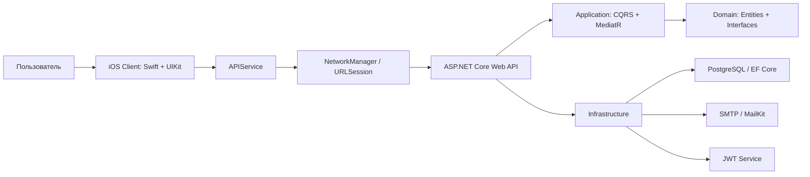
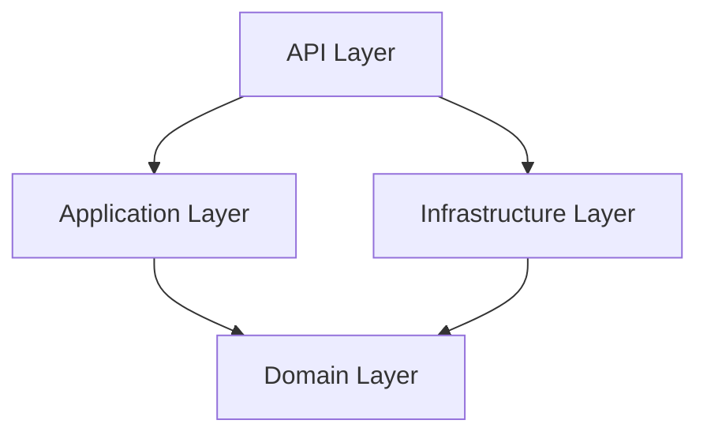
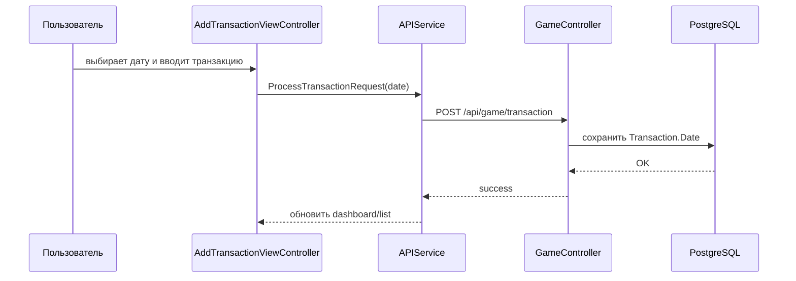

# FundFighters

**FundFighters** - iOS-приложение для учета личных финансов с геймификацией: расходы, доходы и накопления превращаются в понятный игровой прогресс, а финансовая цель визуализируется как противник, которого пользователь побеждает регулярными сбережениями.

Проект состоит из нативного UIKit-клиента и backend API на ASP.NET Core. Он разработан как курсовой проект с акцентом на чистую архитектуру, безопасность, работу с датами транзакций, аналитические отчеты и цельный визуальный стиль приложения.

Автор: **Прахов Данил, БПИ246**
Дисциплина: **Курсовой проект, ФКН НИУ ВШЭ**
Год: **2026**

---

## Суть проекта

Обычные финансовые трекеры часто воспринимаются как таблица расходов: пользователь вносит суммы, смотрит категории и быстро теряет мотивацию. FundFighters решает ту же практическую задачу, но подает ее через игровую механику:

- пользователь создает или получает финансовую цель;
- цель отображается как "враг" или босс;
- накопления уменьшают оставшуюся сумму до цели;
- расходы и доходы сохраняются как транзакции;
- аналитика показывает структуру расходов, денежный поток и прогресс;
- профиль содержит уровень, XP, серию активности и настройки безопасности.

Идея приложения: **финансовая дисциплина должна ощущаться как прогресс, а не как наказание**.

---

## Основные возможности

### Финансовый учет

- добавление доходов и расходов;
- выбор категории транзакции;
- выбор даты и времени транзакции;
- просмотр транзакций за конкретный день;
- удаление транзакций;
- расчет месячных доходов и расходов;
- отображение баланса и динамики.

### Геймификация

- цель накопления представлена как противник;
- прогресс цели отображается через сердца, проценты и оставшуюся сумму;
- отдельная сцена битвы показывает визуальное противостояние;
- накопления приближают пользователя к победе над целью;
- профиль хранит уровень, XP и серию активности.

### Аналитика и отчеты

- экран аналитики с финансовым рангом;
- donut chart структуры расходов;
- денежный поток по периодам;
- отчет по неделе, месяцу и году;
- прогноз накоплений;
- список категорий с суммами, XP и динамикой;
- fallback/mock-данные для демонстрации, если сервер пока не вернул достаточно информации.

### Авторизация и безопасность

- регистрация по email;
- подтверждение email кодом;
- вход по email и паролю;
- JWT-сессия;
- BCrypt-хеширование паролей;
- двухфакторная аутентификация через email-код;
- включение и выключение 2FA из профиля;
- восстановление пароля.

### Профиль и персонализация

- отображение username и UID;
- смена имени с сохранением на сервере;
- смена аватара;
- переключение языка приложения;
- выход из аккаунта;
- сводка месяца;
- серия активности на основе дней подряд с транзакциями.

---

## Архитектура



Архитектурно проект разделен на два крупных приложения:

- **Client** - нативное iOS-приложение на UIKit.
- **Backend** - ASP.NET Core API, построенный по Clean Architecture.

---

## Клиент

Клиент находится в:

```text
Client/FundFighters.Client/FundFighters.Client
```

### Клиентские слои

| Слой | Назначение |
|---|---|
| `App` | `AppDelegate`, `SceneDelegate`, старт приложения |
| `Core` | сеть, storage, дизайн-система, UI-компоненты, extensions |
| `Models` | DTO-модели API |
| `Modules` | экраны и пользовательские сценарии |
| `Resources` | ассеты, launch screen, изображения |
| `Fonts` | Golos Text и Inter |

### Ключевые клиентские файлы

| Файл | Назначение |
|---|---|
| `Core/Network/NetworkManager.swift` | низкоуровневый HTTP-клиент на `URLSession` |
| `Core/Network/APIService.swift` | сервис методов API: auth, dashboard, game, profile |
| `Core/Network/APIError.swift` | единая модель ошибок |
| `Core/Storage/TokenManager.swift` | хранение JWT |
| `Core/Storage/UserManager.swift` | локальное состояние пользователя, язык, профиль, аватар |
| `Core/DesignSystem.swift` | цвета, шрифты, дизайн-токены |
| `Core/UI/LiquidGlassComponents.swift` | liquid-glass кнопки, карточки и эффекты |
| `Core/UI/GreenCircleButton.swift` | унифицированная зеленая круглая кнопка |
| `Models/AuthModels.swift` | DTO авторизации и транзакций |
| `Models/DashboardModels.swift` | DTO дашборда |
| `Models/GameModels.swift` | DTO игровой части |

### Основные модули клиента

| Модуль | Содержимое |
|---|---|
| `Onboarding` | splash, entry animation, tutorial, выбор языка |
| `Auth` | login, register, verification, forgot password |
| `Dashboard` | главный экран, транзакции, карточки баланса, цели, активности, расходов, битв |
| `Battle` | сцена битвы и действия накопления/расхода |
| `Reports` | финансовый отчет |
| `Tapbar` | кастомный tab bar, аналитика, профиль |

---

## Backend

Backend находится в:

```text
Backend
```

Solution:

```text
Backend/FundFighters.Backend.sln
```

### Backend-проекты

| Проект | Слой | Назначение |
|---|---|---|
| `FundFighters.Backend.API` | Presentation | REST API, controllers, auth middleware, Swagger |
| `FundFighters.Backend.Application` | Application | CQRS-команды, запросы, handlers, DTO, interfaces |
| `FundFighters.Backend.Domain` | Domain | сущности, enum, repository contract |
| `FundFighters.Backend.Infrastructure` | Infrastructure | EF Core, PostgreSQL, repository, JWT, SMTP, migrations |

### Clean Architecture



Domain-слой не зависит от деталей базы данных, HTTP или почты. Application-слой описывает сценарии, а Infrastructure предоставляет конкретные реализации.

---

## API

После запуска backend Swagger доступен локально по адресу:

```text
http://localhost:5217/swagger
```

### Auth

| Метод | Endpoint | Назначение |
|---|---|---|
| `POST` | `/api/auth/register` | регистрация |
| `POST` | `/api/auth/verify` | подтверждение email |
| `POST` | `/api/auth/login` | вход |
| `POST` | `/api/auth/verify-login` | подтверждение 2FA |
| `POST` | `/api/auth/forgot-password` | запрос восстановления пароля |
| `POST` | `/api/auth/reset-password` | сброс пароля |
| `PUT` | `/api/auth/two-factor` | переключение 2FA |
| `PUT` | `/api/auth/profile` | обновление username |

### Dashboard

| Метод | Endpoint | Назначение |
|---|---|---|
| `GET` | `/api/dashboard/data` | полный dashboard |
| `GET` | `/api/dashboard/balance` | баланс |
| `GET` | `/api/dashboard/active-goal` | активная цель |
| `GET` | `/api/dashboard/recent-transactions` | последние транзакции |
| `GET` | `/api/dashboard/recent-battles` | последние битвы |
| `GET` | `/api/dashboard/expense-categories` | категории расходов |

### Game

| Метод | Endpoint | Назначение |
|---|---|---|
| `POST` | `/api/game/transaction` | добавить транзакцию |
| `DELETE` | `/api/game/transaction/{id}` | удалить транзакцию |
| `GET` | `/api/game/battle-state` | получить состояние битвы |

---

## Аналитика и отчет

Аналитика в FundFighters устроена как слой поверх реальных финансовых данных пользователя.

### Что анализируется

- доходы за период;
- расходы за период;
- чистый денежный поток;
- структура расходов по категориям;
- прогресс цели;
- XP и финансовый ранг;
- активность по дням;
- серия дней с транзакциями.

### Откуда берутся данные

Основной источник - `GET /api/dashboard/data`. Backend возвращает:

- `balanceInfo`;
- `activeGoal`;
- `recentTransactions`;
- `recentBattles`;
- `expenseCategories`;
- `userInfo`.

На клиенте эти данные агрегируются и отображаются на dashboard, analytics и reports screens.

### Почему есть mock/fallback-данные

Некоторые аналитические элементы требуют большой истории операций. Если данных еще мало, интерфейс не должен выглядеть пустым или сломанным. Поэтому используются fallback values:

- демонстрационные категории;
- примерный денежный поток;
- прогноз накоплений;
- заполненные графики.

Когда реальные данные появляются, экран использует их.

### Экран отчета

Отчет показывает:

- переключатель `Неделя / Месяц / Год`;
- чистый денежный поток;
- total income;
- total expense;
- список категорий;
- XP по категориям;
- динамику в процентах;
- прогноз накоплений.

Идея отчета: дать не просто список транзакций, а короткий ответ на вопрос: **"как я финансово прошел этот период?"**

---

## Работа с датами

Одна из важных технических частей проекта - корректная работа с датой транзакции.

Пользователь может выбрать дату и время при добавлении транзакции. Клиент отправляет дату в `ProcessTransactionRequest.date`, backend сохраняет ее в `Transaction.Date`, а dashboard и списки фильтруют данные именно по сохраненной дате.

Это важно, потому что без передачи даты транзакция всегда попадала бы в текущий день.



---

## Безопасность

| Механизм | Реализация |
|---|---|
| Хеширование паролей | BCrypt |
| Сессии | JWT Bearer |
| Подтверждение email | verification code через SMTP |
| 2FA | login code через SMTP |
| Защищенные endpoints | `[Authorize]` |
| Локальное хранение токена | `TokenManager` |
| Профиль пользователя | `UserManager` + server sync |

2FA включается в профиле. Если она активна, login сначала отправляет код на email, а JWT выдается только после `verify-login`.

---

## Технологический стек

### iOS

- Swift
- UIKit
- Auto Layout
- URLSession
- PhotosUI
- NotificationCenter
- UserDefaults
- SF Symbols
- CAGradientLayer
- UIVisualEffectView
- UIView spring animations

### Backend

- .NET / ASP.NET Core
- C#
- Entity Framework Core
- PostgreSQL
- MediatR
- BCrypt.Net
- JWT Bearer authentication
- MailKit / SMTP
- Swagger / OpenAPI

### Архитектурные подходы

- Clean Architecture
- CQRS
- Mediator
- Repository
- DTO mapping
- MVVM
- Service Layer
- Component-based UI
- Programmatic UIKit

---

## Запуск backend

### Требования

- .NET SDK
- PostgreSQL
- SMTP-аккаунт для отправки кодов

### Настройка конфигурации

Файл:

```text
Backend/FundFighters.Backend.API/appsettings.json
```

Нужно настроить:

- connection string PostgreSQL;
- JWT settings;
- SMTP settings.

Пример:

```json
{
  "ConnectionStrings": {
    "DefaultConnection": "Host=localhost;Port=5432;Database=fundfighters;Username=postgres;Password=YOUR_PASSWORD"
  },
  "SmtpSettings": {
    "Server": "smtp.gmail.com",
    "Port": 587,
    "SenderEmail": "YOUR_EMAIL@gmail.com",
    "AppPassword": "YOUR_APP_PASSWORD",
    "SenderName": "FundFighters"
  }
}
```

### Миграции

```bash
cd Backend/FundFighters.Backend.API
dotnet ef database update --project ../FundFighters.Backend.Infrastructure --startup-project .
```

### Запуск

```bash
cd Backend/FundFighters.Backend.API
dotnet run
```

По умолчанию API используется клиентом по адресу:

```text
http://localhost:5217/api
```

---

## Запуск iOS-клиента

1. Открыть проект:

```text
Client/FundFighters.Client
```

2. Запустить backend.
3. Открыть клиент в Xcode или Rider.
4. Выбрать iPhone simulator.
5. Запустить приложение.

Для симулятора `localhost` указывает на локальную машину, поэтому клиент может обращаться к backend по `http://localhost:5217/api`.

---

## Структура репозитория

```text
FundFighters
├── Backend
│   ├── FundFighters.Backend.API
│   ├── FundFighters.Backend.Application
│   ├── FundFighters.Backend.Domain
│   └── FundFighters.Backend.Infrastructure
├── Client
│   └── FundFighters.Client
│       └── FundFighters.Client
│           ├── App
│           ├── Core
│           ├── Models
│           ├── Modules
│           ├── Resources
│           └── Fonts
├── README.md
└── TECH_REPORT.md
```

---

## Проверка и разработка

Полезные команды:

```bash
dotnet build Backend/FundFighters.Backend.Application/FundFighters.Backend.Application.csproj --no-restore
```

```bash
swiftc -parse $(rg --files Client/FundFighters.Client/FundFighters.Client -g '*.swift')
```

```bash
git diff --check
```

Для ручной проверки API можно использовать:

```text
Backend/FundFighters.Backend.API/FundFighters.API.http
```

---

## Что важно показать при демонстрации

1. Регистрация, вход и 2FA.
2. Dashboard с балансом, целью, активностью, расходами и битвой.
3. Добавление транзакции на выбранную дату.
4. Отображение транзакции в нужном дне.
5. Экран битвы и связь с накоплением.
6. Аналитика: ранг, структура расходов, денежный поток.
7. Отчет: период, категории, прогноз накоплений.
8. Профиль: имя, аватар, 2FA, язык, logout.

---

## Автор

Прахов Данил

Группа: БПИ246

GitHub: [danilprakh0v](https://github.com/danilprakh0v)

Telegram: [@danilprakhov](https://t.me/danilprakhov)

---

## Статус

Проект подготовлен как курсовая работа: реализованы backend, iOS-клиент, авторизация, 2FA, dashboard, транзакции, профиль, аналитика, отчеты и игровая механика финансовых целей.
