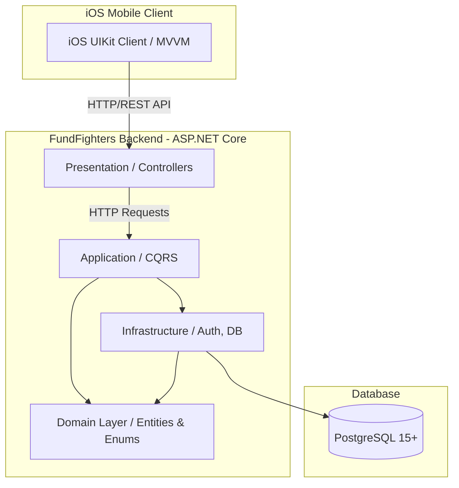

# FundFighters — Финансовый трекер с геймификацией (Backend API & iOS Client)

---

**Автор:** Прахов Данил  
**Группа:** БПИ246  
**Дисциплина:** Курсовой проект "FundFighters" (ФКН НИУ ВШЭ)  
**Дата:** Апрель 2026 г.

---

## 🎯 Описание проекта

**FundFighters** — это не просто очередной финансовый трекер. Мы подошли к учету личных финансов как к увлекательной RPG-игре, где каждая накопленная монета приближает вас к победе над "Монстром", символизирующим вашу финансовую цель. 

Удобное, нативное iOS-приложение (на UIKit) взаимодействует с отказоустойчивым и полнофункциональным бэкендом на базе ASP.NET Core 10.0. Система разработана в рамках курсовой работы с упором на чистую архитектуру (Clean Architecture), паттерн CQRS, глубокую работу с безопасностью (BCrypt, JWT, 2FA) и создание интуитивно понятного, пиксель-перфектного интерфейса пользователя.

---

## 🏗 Архитектура системы

Бэкенд спроектирован в соответствии с многоуровневой архитектурой (Clean Architecture), что гарантирует четкое разделение бизнес-логики от внешних зависимостей и упрощает тестирование компонентов.



### Основные слои бэкенда

| Слой | Проект | Назначение |
|------|--------|-----------|
| **Presentation** | `FundFighters.Backend.API` | REST-контроллеры, маршрутизация, конфигурация приложения (`Program.cs`, `appsettings.json`) |
| **Application** | `FundFighters.Backend.Application` | Бизнес-логика, реализация паттерна CQRS, валидация DTO и обработчики (Handlers) через MediatR |
| **Domain** | `FundFighters.Backend.Domain` | Ядро системы: модели предметной области (Entities), интерфейсы и перечисления (Enums) |
| **Infrastructure** | `FundFighters.Backend.Infrastructure` | Реализация Entity Framework Core, репозитории, внешние сервисы (SMTP MailKit, JWT Auth) и миграции БД |

---

## 🔥 Ключевые возможности

### 🔐 Безопасность и Авторизация
- **BCrypt** для надежного, криптостойкого хеширования паролей.
- **JWT** (JSON Web Token) для контроля и управления сессиями.
- **Двухфакторная аутентификация (2FA)** через временные коды на email.
- **CORS** политики для защиты от межсайтовых подделок запросов.

### 💰 Управление финансами (Геймификация)
- **Боевая система сбережений:** Вместо скучного прогресс-бара, цели представлены "боссами" с HP-баром. Ваша задача — наносить урон (откладывать деньги), чтобы победить их!
- **Аналитика активности:** Подробная и интуитивно понятная отчетность по доходам и расходам.
- **XP и уровни профиля:** Вы получаете очки опыта (XP) и повышаете уровень за финансовую дисциплину.

### 📱 iOS Клиент
- 100% верстка кодом с использованием Auto Layout (без Storyboards) для высшей степени контроля над рендерингом UI.
- Архитектурный подход **MVVM** вкупе с Coordinator-логикой роутинга.
- Кастомные компоненты, градиентные слои (`CAGradientLayer`) и сложные пружинные анимации (`UIView.animate`).

### 📧 Система уведомлений
- Интеграция с **SMTP / MailKit** для уверенной доставки email-уведомлений.
- Профессиональные HTML-шаблоны электронных писем (верификация почты и 2FA коды), выдержанные в едином стиле приложения.

---

## 🛠 Технологический стек

| Компонент | Технологии |
|-----------|------------|
| **Мобильный клиент** | iOS 15+, Swift, UIKit, MVVM |
| **Платформа** | .NET 10.0, ASP.NET Core 10.0 |
| **База Данных / ORM** | PostgreSQL, Entity Framework Core 10.0 |
| **Архитектура** | Clean Architecture, CQRS (MediatR) |
| **Безопасность/Криптография** | BCrypt.Net, JWT |
| **Дополнительные пакеты** | MailKit, Swagger (OpenAPI) |

---

## 🚀 Инструкция по запуску

### Базовые требования
- **.NET 10.0 SDK** ([Скачать](https://dotnet.microsoft.com/download))
- **PostgreSQL 15+** (или локально, или в Docker).
- **macOS** (если вы планируете запускать нативный iOS клиент через Xcode или Rider).

### 1. Клонирование репозитория

```bash
git clone git@github.com:danilprakh0v/FundFighters.git
cd FundFighters
```

### 2. Конфигурация базы данных и SMTP-сервиса

> [!IMPORTANT]  
> **Настройка SMTP Email Сервиса (SenderEmail и AppPassword)**  
> Для полноценной работы аутентификации (отправки кодов 2FA и подтверждения регистрации), бэкенду необходимо подключиться к почтовому ящику. Если вы используете Gmail:  
> 1. Включите 2-Step Verification в аккаунте Google.  
> 2. Перейдите в **Security -> App Passwords**.  
> 3. Сгенерируйте 16-значный пароль приложения (App Password). Обычный пароль от почты работать не будет из-за политик безопасности.

Откройте `Backend/FundFighters.Backend.API/appsettings.json` и настройте параметры так, как показано ниже:

```json
{
  "ConnectionStrings": {
    "DefaultConnection": "Host=localhost;Port=5432;Database=fundfighters;Username=danilprakhov;Password=ВАШ_ПАРОЛЬ_ОТ_БД;"
  },
  "SmtpSettings": {
    "Server": "smtp.gmail.com",
    "Port": 587,
    "SenderEmail": "ВАШ_EMAIL@gmail.com",     // <--- Внесите сюда ваш email-отправитель
    "AppPassword": "ВАШ_APP_PASSWORD",        // <--- 16-значный пароль приложения
    "SenderName": "FundFighters"
  }
}
```

### 3. Применение миграций БД

Для создания схемы базы данных перейдите в папку с проектом API и примените миграции:

```bash
cd Backend/FundFighters.Backend.API
dotnet ef database update --project ../FundFighters.Backend.Infrastructure --startup-project .
```

### 4. Запуск сервера

Для запуска бэкенда:

```bash
dotnet run
```
По умолчанию бэкенд запустится на *http://localhost:5217* (или ином порту согласно конфигурации в `launchSettings.json`).

### 5. Запуск iOS Клиента
1. Откройте папку `Client/FundFighters.Client` в Xcode или JetBrains Rider.
2. Выберите симулятор (например, iPhone 15 Pro).
3. Нажмите кнопку Run (`Cmd + R`). Не забудьте убедиться, что сервер запущен.

---

## 💻 API Документация (Ключевые эндпоинты)

*Вся документация доступна локально в формате Swagger UI (после запуска бэкенда перейдите на `/swagger`).*

| Метод | Эндпоинт | payload (тело запроса) | Описание |
|-------|----------|------------------------|----------|
| `POST` | `/api/auth/register` | `username`, `email`, `password` | Регистрация нового аккаунта (высылает код верификации) |
| `POST` | `/api/auth/verify` | `email`, `code` | Подтверждение введенного email после регистрации |
| `POST` | `/api/auth/login` | `email`, `password` | Логин (высылает код 2FA на почту) |
| `POST` | `/api/auth/verify-login` | `email`, `code` | Верификация 2FA кода и получение JWT токена (Access) |

---

## 👨‍💻 Рекомендации к разработке

**Добавление новой миграции EF Core:**

Если вы обновили Entity в Domain слое, выполните команду (находясь в папке с `FundFighters.Backend.API`):
```bash
dotnet ef migrations add NameOfMigration --project ../FundFighters.Backend.Infrastructure --startup-project .
```

Она безопасно сгенерируется внутри слоя `Infrastructure/Migrations`.

---

## 📜 Лицензия и Контакты

Образовательный проект. Все права защищены (2026).

**Автор:** Прахов Данил  
**Email:** danilla9083@gmail.com  
**GitHub:** [@danilprakh0v](https://github.com/danilprakh0v)  
**Telegram:** [@kirayoshikag](https://t.me/kirayoshikag)  

> Проект разработан как курсовая работа с целью закрепления современных подходов к созданию нативных мобильных клиентов и отказоустойчивых облачных бэкенд-решений.