# Technical Report - FundFighters

Курсовой проект, ФКН ВШЭ (НИС)
Автор: Прахов Данил

## 1. Назначение проекта

FundFighters - мобильное финансовое приложение с игровым слоем. Пользователь ведет учет доходов, расходов и накоплений, а финансовое поведение отображается как прогресс в сражении с "врагом" или целью. Центральная идея проекта: сделать трекинг денег менее сухим и более мотивирующим за счет геймификации.

Система состоит из двух основных частей:

- iOS-клиент на UIKit и Swift.
- Backend API на ASP.NET Core с Clean Architecture, CQRS, MediatR, EF Core и PostgreSQL.

Клиент отвечает за пользовательский сценарий, визуализацию, локальное состояние, локализацию, анимации и отправку команд на сервер. Backend отвечает за авторизацию, хранение пользователей, транзакций, целей, битв, категорий, расчет дашборда, обработку транзакций, JWT и двухфакторную аутентификацию.

## 2. Верхнеуровневая архитектура

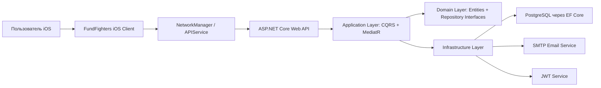

Архитектура построена так, чтобы визуальная часть и бизнес-логика не смешивались:

- UIKit-контроллеры не обращаются напрямую к URLSession.
- Сетевой слой клиента скрыт за `APIService`.
- Backend-контроллеры не содержат сложных расчетов предметной области.
- Application-слой получает команды и запросы через MediatR.
- Domain-слой описывает сущности и контракты.
- Infrastructure реализует доступ к базе данных, JWT и почтовые сервисы.

## 3. Архитектура клиента

### 3.1. Общая структура клиента

Клиент расположен в:

`Client/FundFighters.Client/FundFighters.Client`

Основные группы:

- `App` - точка входа UIKit-приложения.
- `Core` - общие сервисы, дизайн-система, сеть, хранилище, UI-компоненты.
- `Models` - DTO-модели для API.
- `Modules` - пользовательские экраны и сценарии.
- `Resources` - ассеты, storyboard запуска, иконки.
- `Fonts` - кастомные шрифты.

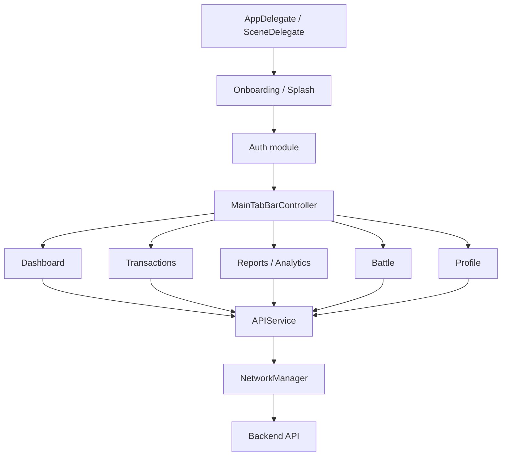

### 3.2. Клиентские архитектурные принципы

В клиенте используется несколько архитектурных приемов:

- Programmatic UIKit: интерфейс собирается кодом через Auto Layout.
- MVVM там, где экран имеет отдельную бизнес-логику формы или загрузки данных.
- Service Layer для сетевого API.
- Singleton-сервисы для пользовательской сессии и JWT.
- Component-based UI для крупных карточек дашборда.
- NotificationCenter для реактивного обновления языка, аватара и имени.
- DTO-модели для строгого соответствия JSON-контрактам backend.
- Fallback/mock-data режимы для экранов аналитики и отчетов.
- Локализация через централизованный флаг `UserManager.shared.isRussian`.

## 4. Клиент: слой App

### `App/AppDelegate.swift`

Стандартная точка входа UIKit-приложения. Отвечает за базовую инициализацию приложения на уровне `UIApplicationDelegate`.

### `App/SceneDelegate.swift`

Отвечает за создание окна приложения, установку стартового root-контроллера и жизненный цикл сцены. В UIKit-приложениях с iOS 13+ именно SceneDelegate управляет окном.

### `App-Info.plist`

Конфигурация iOS-приложения: bundle-настройки, поддерживаемые интерфейсы, launch screen, ресурсы, permissions и системные параметры.

### `Base.lproj/Main.storyboard`

Оставлен как базовый storyboard контейнер проекта. Основной интерфейс приложения реализован программно, чтобы избежать конфликтов storyboard и иметь полный контроль над Auto Layout.

## 5. Клиент: Core layer

### 5.1. Константы и дизайн

#### `Core/Constants.swift`

Файл для глобальных констант приложения. Он нужен для параметров, которые используются в разных модулях и не должны дублироваться в контроллерах.

#### `Core/DesignSystem.swift`

Центральная дизайн-система клиента. Содержит:

- цвета приложения;
- шрифты;
- типографику;
- радиусы;
- базовые визуальные токены.

Дизайн-система снижает расхождение UI между экранами. Вместо ручного задания цветов и шрифтов в каждом контроллере используется единый источник.

#### `Core/UI/LiquidGlassComponents.swift`

Набор визуальных компонентов и токенов liquid-glass стиля:

- стеклянные фоны;
- полупрозрачные материалы;
- блики;
- пружинные реакции на нажатия;
- фирменные зеленые и красные оттенки.

Этот файл формирует визуальный язык приложения: мягкие стеклянные карточки, подсвеченные кнопки, растяжение при нажатии, глубина через тени и blur.

#### `Core/UI/GreenCircleButton.swift`

Унифицированная круглая зеленая кнопка, чаще всего используемая как back-кнопка. Реализует:

- зеленый фон;
- черную SF Symbol иконку;
- border и shadow;
- liquid-glass блик;
- "растягивающуюся" анимацию при нажатии.

Компонент позволяет держать одинаковую кнопку возврата на разных экранах.

#### `Core/UI/InfinityLoadingView.swift`

Пользовательский индикатор загрузки. Используется там, где стандартный `UIActivityIndicatorView` визуально недостаточен для фирменного стиля приложения.

### 5.2. Сетевой слой

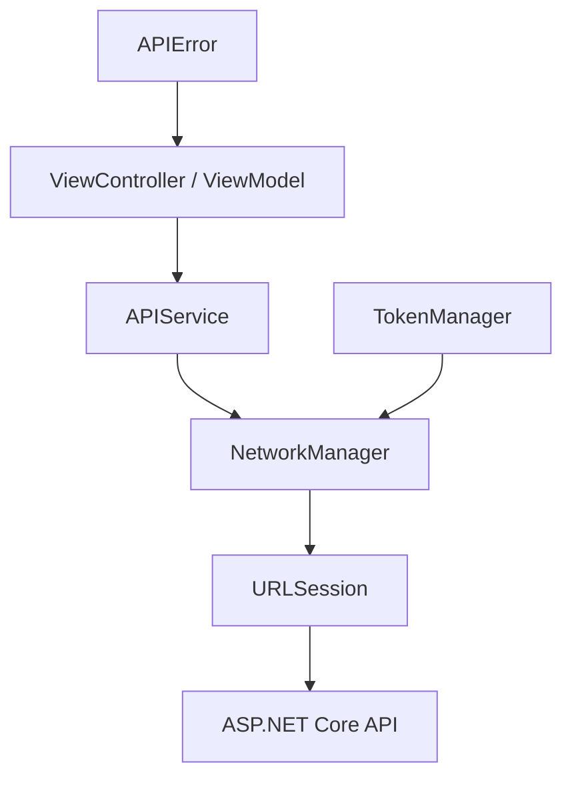

#### `Core/Network/NetworkManager.swift`

Низкоуровневый HTTP-клиент приложения. Основные функции:

- сборка URL из `baseURL` и endpoint;
- настройка HTTP-метода;
- JSON-encode тела запроса;
- добавление заголовка `Authorization: Bearer <token>`;
- выполнение запроса через `URLSession`;
- обработка HTTP-кодов;
- декодирование JSON в generic `Decodable` тип;
- обработка дат, приходящих из .NET backend.

Важная деталь: `NetworkManager` не знает о конкретных бизнес-сценариях. Он только выполняет запросы и возвращает `Result<T, APIError>`.

#### `Core/Network/APIService.swift`

Высокоуровневый сервис API. Он предоставляет методы предметной области:

- `login`
- `register`
- `verifyEmail`
- `verifyLogin`
- `forgotPassword`
- `resetPassword`
- `updateTwoFactor`
- `updateProfile`
- `getDashboard`
- `getBalance`
- `getActiveGoal`
- `getRecentTransactions`
- `getRecentBattles`
- `getExpenseCategories`
- `addTransaction`
- `deleteTransaction`

`APIService` преобразует конкретный сценарий в endpoint, HTTP-метод и DTO. Контроллеры и ViewModel не собирают endpoint-строки сами.

#### `Core/Network/APIError.swift`

Единая модель ошибок сетевого слоя:

- invalid URL;
- request failed;
- decoding failed;
- server error;
- unauthorized;
- unknown.

Также содержит `APIErrorResponse`, который соответствует ошибкам backend с полем `message`. Это позволяет показывать пользователю сообщения сервера.

### 5.3. Локальное состояние

#### `Core/Storage/TokenManager.swift`

Сервис хранения JWT-токена. Отвечает за:

- сохранение токена после логина;
- получение токена при запросах;
- очистку токена при logout или 401.

Архитектурно `TokenManager` отделен от `UserManager`, потому что токен - это credential, а профиль пользователя - состояние приложения.

#### `Core/Storage/UserManager.swift`

Центральное локальное состояние пользователя. Хранит:

- username;
- email;
- userId;
- признак 2FA;
- флаг языка;
- состояние onboarding/tutorial;
- текущую цель накопления;
- аватар;
- локальные показатели сессии.

`UserManager` использует `UserDefaults` как простое persistence-хранилище. Также отправляет `NotificationCenter` события при смене языка, имени и аватара.

### 5.4. Extensions

#### `Core/Extensions/UIColor+App.swift`

Расширения для работы с цветами приложения.

#### `Core/Extensions/UITextField+Extensions.swift`

Расширения для текстовых полей. Используются для унификации поведения input-полей, padding, styling.

#### `Core/Extensions/UIView+Pin.swift`

Утилиты для Auto Layout и быстрого закрепления view к контейнеру.

## 6. Клиент: Models

### `Models/AuthModels.swift`

DTO-модели авторизации:

- `LoginRequest`
- `RegisterRequest`
- `LoginResponse`
- `VerifyCodeRequest`
- `ResendCodeRequest`
- `ForgotPasswordRequest`
- `ResetPasswordRequest`
- `UpdateTwoFactorRequest`
- `TwoFactorStatusResponse`
- `UpdateProfileRequest`
- `ProfileResponse`
- `ProcessTransactionRequest`

Особенности:

- `LoginResponse` декодирует и `userId`, и `playerId`, потому что backend может отдавать ID в разных формах.
- `ProcessTransactionRequest` содержит `date`, чтобы транзакция добавлялась на выбранную пользователем дату, а не только на текущий день.

### `Models/DashboardModels.swift`

DTO-модели данных дашборда:

- общая информация пользователя;
- баланс;
- активная цель;
- последние транзакции;
- последние битвы;
- категории расходов.

Эти модели соответствуют ответу `GET /api/dashboard/data`.

### `Models/GameModels.swift`

Модели игровой части:

- состояние битвы;
- enemy/player related data;
- игровые показатели, которые используются на battle-экране.

## 7. Клиент: Auth module

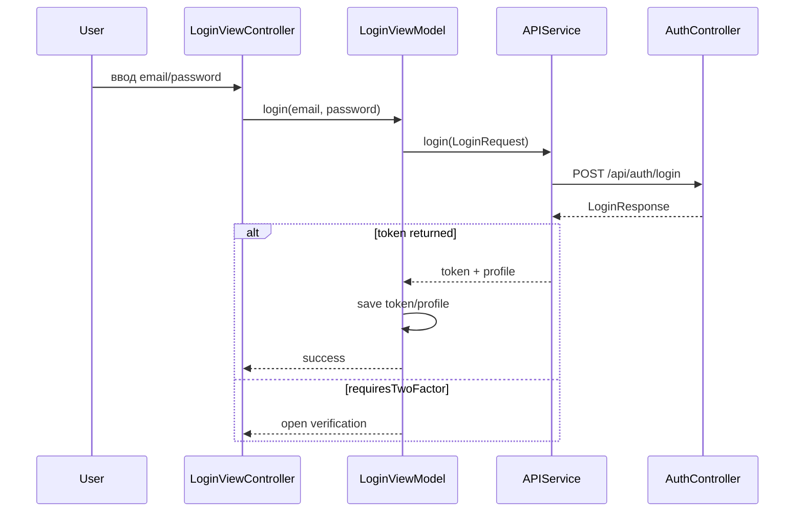

### `Modules/Auth/Login/LoginViewController.swift`

Экран входа. Отвечает за:

- ввод email/password;
- визуальное состояние loading;
- показ ошибок;
- переход к основному экрану;
- переход к 2FA verification;
- локализацию ошибок.

### `Modules/Auth/Login/LoginViewModel.swift`

ViewModel входа. Отвечает за:

- валидацию входных данных;
- вызов `APIService.login`;
- сохранение JWT через `TokenManager`;
- сохранение профиля пользователя через `UserManager`;
- обработку сценария `requiresTwoFactor`;
- передачу событий UI через closures.

После входа серверное имя пользователя считается источником правды, чтобы профиль сразу показывал актуальный username.

### `Modules/Auth/Register/RegisterViewController.swift`

Экран регистрации. Отвечает за:

- многошаговый ввод данных;
- сбор username/email/password;
- UI-анимации регистрации;
- переход на verification screen;
- сохранение pending username до подтверждения email.

### `Modules/Auth/Register/RegisterViewModel.swift`

ViewModel регистрации. Отвечает за:

- проверку обязательных полей;
- сбор `RegisterRequest`;
- вызов `APIService.register`;
- обработку результата регистрации.

### `Modules/Auth/Verification/VerificationViewController.swift`

Экран подтверждения кода. Используется в двух сценариях:

- подтверждение email после регистрации;
- подтверждение 2FA-кода при входе.

Содержит:

- UI ввода verification code;
- ошибочное shaking-поведение;
- success overlay;
- переход в главное приложение.

### `Modules/Auth/Verification/VerificationViewModel.swift`

ViewModel verification. Отвечает за:

- выбор endpoint по типу verification;
- `verifyEmail` для регистрации;
- `verifyLogin` для 2FA;
- сохранение токена после успешного 2FA;
- сохранение профиля пользователя из ответа backend.

### `Modules/Auth/ForgotPassword/ForgotPasswordViewController.swift`

Экран восстановления пароля. Управляет шагами:

- ввод email;
- ввод verification code;
- ввод нового пароля;
- показ loading/errors.

### `Modules/Auth/ForgotPassword/ForgotPasswordViewModel.swift`

ViewModel восстановления пароля. Отвечает за:

- запрос кода восстановления;
- отправку нового пароля;
- обработку ошибок и успешных переходов.

## 8. Клиент: Onboarding module

### `Modules/Onboarding/SplashViewController.swift`

Стартовый экран. Проверяет состояние пользователя, токен, факт прохождения onboarding/tutorial и решает, куда направить пользователя дальше.

### `Modules/Onboarding/EntryAnimationViewController.swift`

Экран входной анимации. Используется для фирменного первого впечатления: плавные появления, движение элементов, эмоциональная подача.

### `Modules/Onboarding/TutorialViewController.swift`

Tutorial-экран. Содержит:

- несколько шагов обучения;
- переключение языка;
- сохранение выбранного языка в `UserManager`;
- мгновенное применение языка в приложении;
- onboarding copy для объяснения механики FundFighters.

### `Modules/Onboarding/OnboardingViewModel.swift`

Модель состояния onboarding. Отделяет данные/шаги onboarding от конкретного view-контроллера.

### `Modules/Onboarding/PaddingLabel.swift`

UILabel с внутренними отступами. Используется там, где обычный label не дает нужного визуального padding.

## 9. Клиент: Dashboard module

Dashboard - главный экран приложения. Он собирает состояние пользователя, баланс, цель, последние транзакции, категории и битвы.

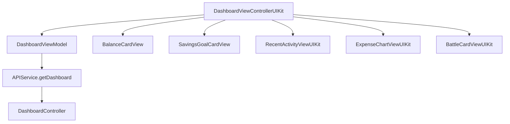

### `Modules/Dashboard/DashboardViewControllerUIKit.swift`

Главный экран. Отвечает за:

- сборку вертикального dashboard layout;
- загрузку данных через ViewModel;
- настройку карточек;
- обновление имени и аватара;
- смену языка;
- переходы к транзакциям, битве, профилю, аналитике;
- реакцию на `NotificationCenter` события.

Важная логика:

- имя пользователя обновляется из серверных данных;
- карточки принимают реальные данные, но имеют fallback для пустых состояний;
- локализация обновляет тексты карточек без перезапуска приложения.

### `Modules/Dashboard/DashboardViewModel.swift`

ViewModel дашборда. Отвечает за:

- вызов `APIService.getDashboard`;
- хранение последнего `DashboardResponse`;
- передачу состояния во ViewController через callbacks;
- хранение ошибки загрузки.

### `Modules/Dashboard/AddTransaction/AddTransactionViewController.swift`

Модальное окно добавления транзакции. Отвечает за:

- ввод суммы;
- выбор типа операции: расход или доход/накопление;
- ввод описания;
- выбор категории;
- выбор даты и времени транзакции;
- отправку `ProcessTransactionRequest`;
- передачу `date` на backend.

Ключевой момент: дата транзакции выбирается пользователем и отправляется на сервер, поэтому транзакция не должна "улетать" на текущий день.

### `Modules/Dashboard/TransactionsViewController.swift`

Экран списка транзакций. Отвечает за:

- загрузку dashboard transactions;
- фильтрацию по выбранной дате;
- красивый date picker;
- добавление транзакции на выбранную дату;
- удаление транзакции через swipe action;
- обновление списка после добавления/удаления.

### `Modules/Dashboard/Components/UIKit/BalanceCardView.swift`

Карточка баланса. Показывает:

- total balance;
- доходы;
- расходы;
- проценты изменения;
- скрытие/показ баланса через eye-button;
- локализацию labels.

### `Modules/Dashboard/Components/UIKit/SavingsGoalCardView.swift`

Карточка активной цели. Показывает:

- название цели;
- текущую сумму;
- target amount;
- процент прогресса;
- сердца прогресса;
- defeated hearts;
- fight-button.

Используется как визуальный мост между финансовой целью и игровой битвой.

### `Modules/Dashboard/Components/UIKit/RecentActivityViewUIKit.swift`

Карточка последних транзакций. Возможности:

- фильтрация по дате;
- date picker;
- навигация вперед/назад по дням;
- строки транзакций;
- локализация;
- удаление транзакций;
- пустое состояние.

### `Modules/Dashboard/Components/UIKit/ExpenseChartViewUIKit.swift`

Карточка структуры расходов. Возможности:

- отображение категорий расходов;
- breakdown bar;
- сумма и процент по категории;
- включение/выключение категорий через чекбоксы;
- mock-data fallback;
- локализация категорий;
- выбор месяца через date picker.

### `Modules/Dashboard/Components/UIKit/BattleCardViewUIKit.swift`

Карточка недавней битвы. Возможности:

- фильтрация битв по дате;
- date picker;
- отображение `recent_enemy`;
- пустое состояние;
- локализация заголовков;
- отображение enemy name при наличии battle data.

### `Modules/Dashboard/Components/UIKit/PillTabSwitcher.swift`

Унифицированный pill segmented control. Используется для переключения периодов:

- week;
- month;
- year.

Имеет зеленое активное состояние, жирный selected text и glass-like оформление.

## 10. Клиент: Battle module

### `Modules/Battle/BattleViewController.swift`

Экран битвы. Визуализирует цель как игрового врага. Отвечает за:

- показ сцены битвы;
- progress goal card;
- игровые sprites;
- действия "Отложить" и "Расход";
- расчет локального отображения прогресса;
- отправку транзакций/накоплений;
- обновление цели;
- анимации персонажей и UI.

Battle-экран связан с финансовой логикой: пользователь совершает финансовое действие, а оно превращается в игровой эффект.

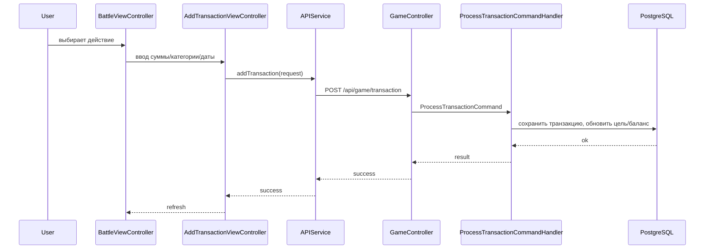

## 11. Клиент: Reports and Analytics

### `Modules/Reports/ReportsViewController.swift`

Экран финансового отчета. Отвечает за:

- период week/month/year;
- расчет net cash flow;
- total income;
- total expense;
- список категорий/направлений;
- сортировку;
- прогноз накоплений;
- локализацию;
- mock fallback, если серверных данных недостаточно.

### Analytics внутри `Modules/Tapbar/MainTabBarController.swift`

В `MainTabBarController.swift` также реализованы несколько крупных экранов и компонентов:

- `MainTabBarController`;
- `GlassTabBar`;
- `AnalyticsDashboardViewController`;
- `AnalyticsRankCard`;
- `AnalyticsRingView`;
- `AnalyticsSpendingCard`;
- `AnalyticsDonutView`;
- `AnalyticsCategoryRow`;
- `AnalyticsFlowCard`;
- `AnalyticsBarsView`;
- `ProfileViewController`;
- `ProfileOptionRow`;
- `ProfileStatsCard`;
- `ProfileMetricPill`;
- `NotificationBellButton`;
- `GreenCircleBackButton`.

Аналитика показывает:

- общий финансовый ранг;
- XP/progress;
- структуру расходов;
- donut chart;
- денежный поток;
- income/expense bars;
- локализованные подписи периода;
- fallback/mock values.

## 12. Клиент: Profile module

Профиль реализован в `Modules/Tapbar/MainTabBarController.swift` как `ProfileViewController`.

Функциональность:

- отображение аватара;
- смена аватара через `PHPickerViewController`;
- отображение username и UID;
- редактирование имени;
- сохранение имени на backend через `PUT /api/auth/profile`;
- переключение 2FA через `PUT /api/auth/two-factor`;
- смена языка;
- logout;
- month summary;
- streak based on consecutive transaction days.

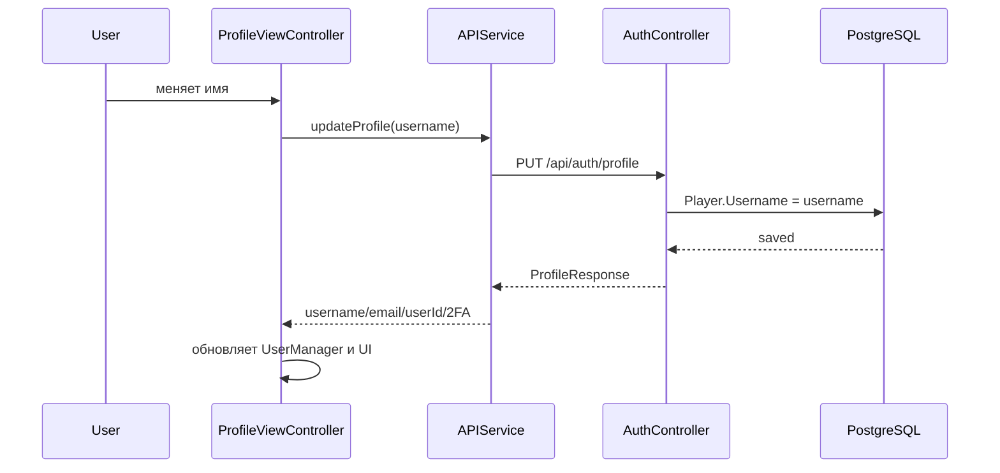

## 13. Клиент: Tabbar and navigation

### `Modules/Tapbar/MainTabBarController.swift`

Главный контейнер приложения после авторизации. Отвечает за:

- кастомный glass tab bar;
- переключение вкладок;
- интеграцию dashboard, analytics, reports, profile и battle;
- показ tutorial при первом входе пользователя;
- общие компоненты верхнего уровня.

### `GlassTabBar`

Кастомный таббар:

- blur background;
- active/inactive icons;
- central action tab;
- анимации scale/opacity;
- visual consistency с liquid-glass стилем.

## 14. Клиент: Resources and Fonts

### Fonts

В проекте используются:

- `GolosText-Bold.ttf`
- `GolosText-Medium.ttf`
- `GolosText-Regular.ttf`
- `GolosText-SemiBold.ttf`
- `Inter_18pt-Bold.ttf`
- `Inter_18pt-ExtraBold.ttf`
- `Inter_18pt-Light.ttf`
- `Inter_18pt-Medium.ttf`
- `Inter_18pt-SemiBold.ttf`

Golos используется как основной кириллический шрифт, Inter - как дополнительная современная нейтральная гарнитура.

### Assets

`Resources/Assets.xcassets` содержит:

- иконки tab bar;
- изображения валютных карточек;
- логотипы;
- onboarding illustration;
- battle sprites;
- heart assets;
- fight assets;
- notification assets;
- `recent_enemy`;
- `battle_bg`;
- AppIcon.

Ассеты используются как визуальная основа геймификации.

## 15. Backend: общая архитектура

Backend находится в:

`Backend`

Solution:

- `FundFighters.Backend.sln`

Проекты:

- `FundFighters.Backend.API`
- `FundFighters.Backend.Application`
- `FundFighters.Backend.Domain`
- `FundFighters.Backend.Infrastructure`

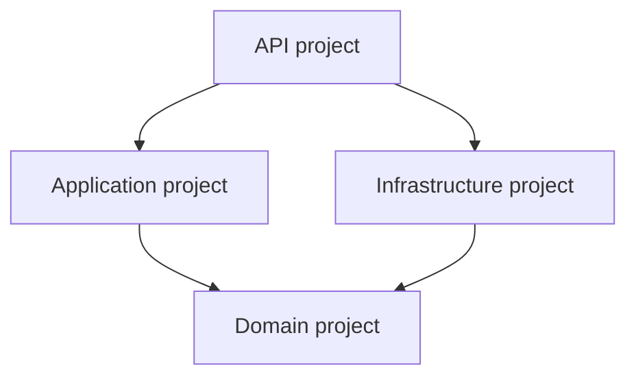

Правило зависимостей:

- API знает Application и Infrastructure.
- Application знает Domain.
- Infrastructure знает Domain и реализует его контракты.
- Domain не знает ни API, ни Infrastructure.

Это соответствует Clean Architecture: бизнес-модель не зависит от деталей доставки HTTP или базы данных.

## 16. Backend: API layer

### `Backend/FundFighters.Backend.API/Program.cs`

Точка входа backend. Отвечает за:

- регистрацию сервисов;
- подключение Application и Infrastructure;
- настройку JWT authentication;
- настройку authorization;
- настройку Swagger/OpenAPI;
- настройку CORS;
- конфигурацию middleware pipeline;
- запуск приложения.

### `Controllers/AuthController.cs`

Контроллер авторизации и пользовательского профиля.

Endpoints:

- `POST /api/auth/register`
- `POST /api/auth/verify`
- `POST /api/auth/login`
- `POST /api/auth/verify-login`
- `POST /api/auth/forgot-password`
- `POST /api/auth/reset-password`
- `PUT /api/auth/two-factor`
- `PUT /api/auth/profile`

Отвечает за:

- регистрацию;
- email verification;
- login;
- 2FA verification;
- восстановление пароля;
- включение/выключение 2FA;
- обновление username.

### `Controllers/DashboardController.cs`

Контроллер данных главного экрана.

Endpoints:

- `GET /api/dashboard/data`
- `GET /api/dashboard/balance`
- `GET /api/dashboard/active-goal`
- `GET /api/dashboard/recent-transactions`
- `GET /api/dashboard/recent-battles`
- `GET /api/dashboard/expense-categories`

Использует JWT user id из claims и возвращает агрегированное состояние пользователя.

### `Controllers/GameController.cs`

Контроллер игровой и транзакционной логики.

Endpoints:

- обработка новой транзакции;
- удаление транзакции;
- получение battle state.

Контроллер переводит HTTP-запросы в Application-команды/запросы.

### `DTOs/Requests/ProcessTransactionRequest.cs`

Request DTO для создания транзакции:

- amount;
- type;
- title;
- category;
- date.

Поле `date` важно для корректного создания транзакций на выбранную пользователем дату.

### `appsettings.json` и `appsettings.Development.json`

Конфигурация backend:

- connection string;
- JWT settings;
- SMTP settings;
- environment-specific параметры.

### `Properties/launchSettings.json`

Профили запуска API из IDE/CLI.

### `FundFighters.API.http`

HTTP scratch-файл для ручной проверки endpoints.

### `wwwroot/assets/Logo FF.png`

Статический frontend/backend asset.

## 17. Backend: Application layer

Application layer содержит use cases. Основной подход - CQRS:

- Commands меняют состояние.
- Queries читают состояние.
- Handlers исполняют конкретный сценарий.

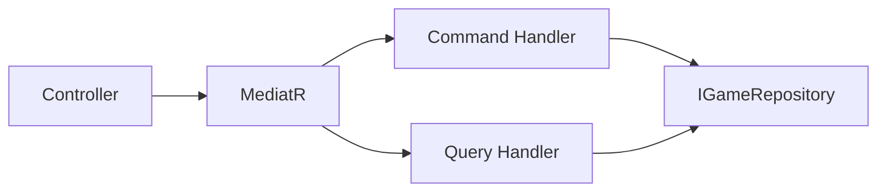

### `ApplicationAssemblyMarker.cs`

Marker class для регистрации MediatR handlers из сборки Application.

### `DependencyInjection.cs`

Расширение для регистрации Application-layer сервисов:

- MediatR;
- handlers;
- application dependencies.

### DTOs

#### `DTOs/DashboardDto.cs`

Агрегированный DTO dashboard:

- UserInfo;
- BalanceInfo;
- ActiveGoal;
- RecentTransactions;
- RecentBattles;
- ExpenseCategories.

#### `DTOs/BattleStateDto.cs`

DTO состояния битвы:

- enemy data;
- player progress;
- goal progress;
- battle values.

#### `DTOs/TransactionPreviewDto.cs`

DTO краткого отображения транзакции.

### Interfaces

#### `Interfaces/IEmailService.cs`

Контракт email-сервиса. Используется Application-слоем, но реализация находится в Infrastructure.

#### `Interfaces/IJwtService.cs`

Контракт JWT-сервиса. Application запрашивает токен через интерфейс, не зная деталей генерации JWT.

### Auth commands and queries

#### `Features/Auth/Commands/RegisterCommand.cs`

Команда регистрации пользователя. Содержит username, email, password.

#### `Features/Auth/CommandHandlers/RegisterCommandHandler.cs`

Handler регистрации:

- проверяет обязательные поля;
- проверяет email на уникальность;
- генерирует verification code;
- хеширует пароль BCrypt;
- создает `Player`;
- сохраняет в БД;
- отправляет verification email.

#### `Features/Auth/Commands/VerifyEmailCommand.cs`

Команда подтверждения email.

#### `Features/Auth/CommandHandlers/VerifyEmailCommandHandler.cs`

Handler подтверждения email:

- проверяет code;
- переводит пользователя в verified state;
- вызывает seed player data;
- возвращает результат подтверждения.

#### `Features/Auth/Commands/ForgotPasswordCommand.cs`

Команда запроса восстановления пароля.

#### `Features/Auth/CommandHandlers/ForgotPasswordCommandHandler.cs`

Handler восстановления:

- проверяет email;
- генерирует reset code;
- отправляет код на email.

#### `Features/Auth/Commands/ResetPasswordCommand.cs`

Команда установки нового пароля.

#### `Features/Auth/CommandHandlers/ResetPasswordCommandHandler.cs`

Handler сброса пароля:

- проверяет email и code;
- хеширует новый пароль;
- обновляет пароль игрока.

#### `Features/Auth/Commands/UpdateProfileCommand.cs`

Команда обновления профиля пользователя. Используется для изменения username.

#### `Features/Auth/CommandHandlers/UpdateProfileCommandHandler.cs`

Handler обновления профиля:

- находит игрока по id;
- обновляет username;
- сохраняет изменения.

#### `Features/Auth/Queries/LoginQuery.cs`

Query логина пользователя.

#### `Features/Auth/QueryHandlers/LoginQueryHandler.cs`

Handler логина:

- ищет пользователя по email;
- проверяет пароль;
- проверяет verified state;
- если включена 2FA, генерирует код и отправляет email;
- если 2FA не нужна, генерирует JWT;
- возвращает token/profile flags.

#### `Features/Auth/Queries/VerifyLoginCodeQuery.cs`

Query подтверждения 2FA-кода.

#### `Features/Auth/QueryHandlers/VerifyLoginCodeQueryHandler.cs`

Handler подтверждения 2FA:

- проверяет code;
- генерирует JWT;
- возвращает username/email/playerId/isTwoFactorEnabled.

### Battle commands and queries

#### `Features/Battle/Commands/ProcessTransactionCommand.cs`

Команда обработки транзакции. Содержит:

- player id;
- amount;
- type;
- title;
- category;
- date.

#### `Features/Battle/Commands/ProcessTransactionCommandHandler.cs`

Handler транзакции:

- создает `Transaction`;
- меняет баланс игрока;
- обновляет цель накопления;
- начисляет XP;
- при необходимости создает/обновляет battle progress;
- сохраняет изменения.

#### `Features/Battle/Commands/DeleteTransactionCommand.cs`

Команда удаления транзакции.

#### `Features/Battle/Commands/DeleteTransactionCommandHandler.cs`

Handler удаления:

- находит транзакцию;
- удаляет ее;
- пересчитывает/сохраняет состояние.

#### `Features/Battle/Queries/GetBattleStateQuery.cs`

Query получения состояния битвы.

#### `Features/Battle/Queries/GetBattleStateQueryHandler.cs`

Handler получения battle state:

- загружает игрока;
- загружает активную цель;
- собирает DTO состояния битвы.

### Dashboard queries

#### `Features/Dashboard/Queries/GetDashboardQuery.cs`

Query агрегированного dashboard.

#### `Features/Dashboard/QueryHandlers/GetDashboardQueryHandler.cs`

Handler dashboard:

- загружает player;
- загружает transactions/goals/battles/categories;
- считает monthly income;
- считает monthly expense;
- определяет active goal;
- собирает `DashboardDto`.

## 18. Backend: Domain layer

Domain layer описывает предметную область.

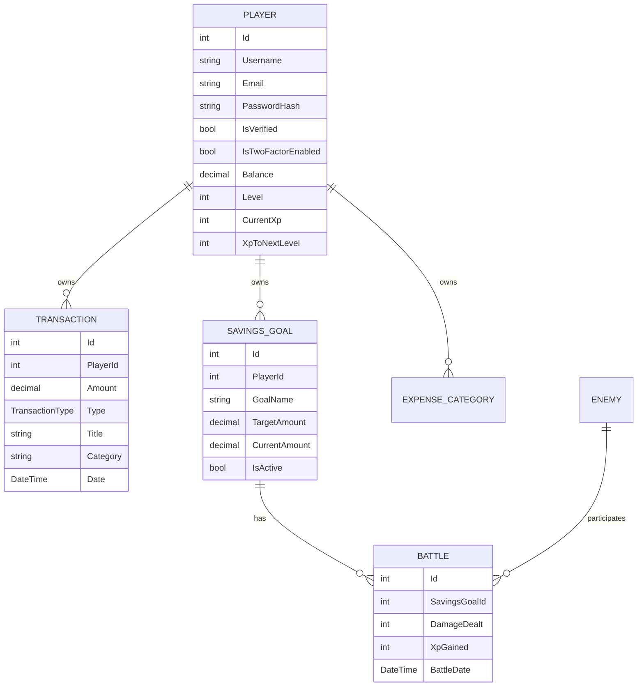

### Entities

#### `Entities/BaseEntity.cs`

Базовая сущность:

- Id;
- CreatedAt;
- UpdatedAt.

#### `Entities/Player.cs`

Пользователь системы. Содержит:

- username;
- email;
- password hash;
- verification code;
- 2FA flags/code;
- balance;
- level;
- XP;
- navigation collections.

#### `Entities/Transaction.cs`

Финансовая операция:

- amount;
- type;
- title;
- category;
- date;
- icon url;
- player relation.

#### `Entities/SavingsGoal.cs`

Финансовая цель:

- goal name;
- description;
- target amount;
- current amount;
- image url;
- hearts;
- active flag.

#### `Entities/Battle.cs`

Запись битвы:

- savings goal id;
- damage;
- XP;
- result;
- battle date.

#### `Entities/Enemy.cs`

Сущность врага. Используется для игровой модели и визуализации цели как противника.

#### `Entities/ExpenseCategory.cs`

Категория расходов:

- name;
- color;
- icon;
- sort order;
- player relation.

### Enums

#### `Enums/TransactionType.cs`

Тип транзакции:

- Expense;
- Saving/Income.

### Interfaces

#### `Interfaces/IGameRepository.cs`

Главный repository contract. Описывает методы:

- получение player по id/email;
- добавление player;
- получение dashboard data;
- получение transactions;
- получение goals;
- получение battles;
- получение categories;
- добавление/удаление транзакций;
- сохранение изменений;
- seed player data.

## 19. Backend: Infrastructure layer

Infrastructure содержит конкретные реализации внешних деталей.

### `Data/AppDbContext.cs`

EF Core DbContext. Содержит DbSet:

- Players;
- Transactions;
- SavingsGoals;
- Battles;
- Enemies;
- ExpenseCategories.

Также настраивает:

- связи;
- ключи;
- типы decimal;
- ограничения;
- mapping сущностей.

### `Data/DbInitializer.cs`

Инициализация базы/seed данных. Используется для начального наполнения категорий, целей, врагов и другой демонстрационной информации.

### `Repositories/GameRepository.cs`

Реализация `IGameRepository` через EF Core.

Отвечает за:

- LINQ-запросы к БД;
- include navigation properties;
- сохранение изменений;
- выборку агрегатов;
- seed player data.

### `Services/JwtService.cs`

Реализация `IJwtService`. Генерирует JWT с claims:

- player id;
- email;
- username;
- expiration;
- signing key.

### `Services/SmtpEmailService.cs`

Реализация `IEmailService`. Отвечает за:

- отправку verification code;
- отправку login 2FA code;
- отправку reset password code.

### `DependencyInjection.cs`

Регистрация Infrastructure-сервисов:

- DbContext;
- Repository;
- JwtService;
- EmailService.

### Migrations

`Infrastructure/Migrations` содержит EF Core миграции:

- `InitialCreate`;
- добавление 2FA;
- добавление enemy/goal entity;
- финальные mapping corrections.

Миграции фиксируют эволюцию схемы БД.

## 20. Основные backend-потоки

### 20.1. Регистрация

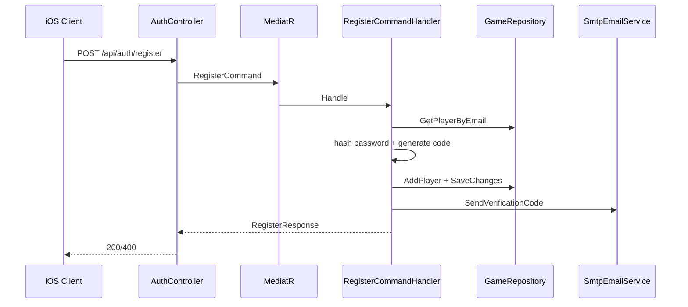

### 20.2. Login без 2FA

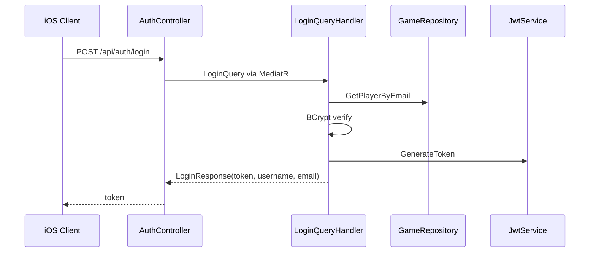

### 20.3. Login с 2FA

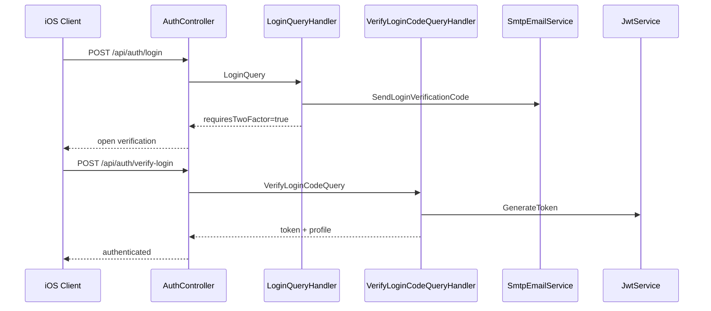

### 20.4. Добавление транзакции

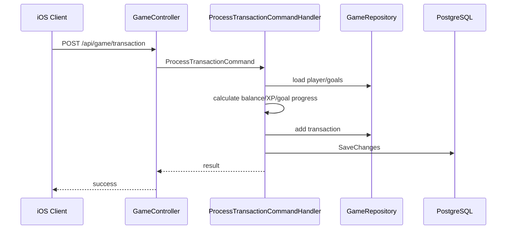

## 21. Паттерны и приемы

### Clean Architecture

Backend разделен на API, Application, Domain и Infrastructure. Это упрощает тестирование и снижает связанность.

### CQRS

Команды и запросы разделены:

- commands меняют состояние;
- queries читают состояние.

### Mediator

MediatR убирает прямую зависимость контроллеров от конкретных handlers.

### Repository

`IGameRepository` скрывает EF Core от Application и Domain.

### DTO

DTO отделяют транспортные модели от domain entities.

### MVVM

В клиенте Auth и Dashboard используют ViewModel для отделения загрузки/валидации от ViewController.

### Service Layer

`APIService` инкапсулирует backend endpoints.

### Singleton Managers

`TokenManager` и `UserManager` централизуют локальное состояние.

### Component-based UI

Dashboard разбит на независимые карточки.

### Programmatic Auto Layout

Интерфейс строится кодом. Это дает:

- контроль constraints;
- меньше конфликтов;
- удобную переиспользуемость компонентов.

### Liquid Glass UI

Используются blur, alpha overlays, borders, shadows, gradients и spring-анимации.

### Fallback/mock data

Аналитика и отчеты могут работать даже при неполных данных backend.

### Localized UI state

Смена языка обновляет UI через `NotificationCenter` и `UserManager`.

## 22. API-контракты

### Auth

| Method | Endpoint | Назначение |
|---|---|---|
| POST | `/api/auth/register` | Регистрация |
| POST | `/api/auth/verify` | Подтверждение email |
| POST | `/api/auth/login` | Вход |
| POST | `/api/auth/verify-login` | Подтверждение 2FA |
| POST | `/api/auth/forgot-password` | Запрос восстановления пароля |
| POST | `/api/auth/reset-password` | Сброс пароля |
| PUT | `/api/auth/two-factor` | Переключение 2FA |
| PUT | `/api/auth/profile` | Обновление username |

### Dashboard

| Method | Endpoint | Назначение |
|---|---|---|
| GET | `/api/dashboard/data` | Полный dashboard |
| GET | `/api/dashboard/balance` | Баланс |
| GET | `/api/dashboard/active-goal` | Активная цель |
| GET | `/api/dashboard/recent-transactions` | Последние транзакции |
| GET | `/api/dashboard/recent-battles` | Последние битвы |
| GET | `/api/dashboard/expense-categories` | Категории расходов |

### Game

| Method | Endpoint | Назначение |
|---|---|---|
| POST | `/api/game/transaction` | Добавить транзакцию |
| DELETE | `/api/game/transaction/{id}` | Удалить транзакцию |
| GET | `/api/game/battle-state` | Получить состояние битвы |

## 23. Хранение и безопасность

### JWT

Backend генерирует JWT, клиент сохраняет его в `TokenManager`, а `NetworkManager` добавляет токен в каждый защищенный запрос.

### Password hashing

Пароли хешируются через BCrypt. Plain-text password не хранится.

### 2FA

2FA включается на profile screen. При включенной 2FA login не сразу возвращает JWT, а отправляет код на email и требует `verify-login`.

### Email verification

Новый пользователь должен подтвердить email code перед полноценным использованием аккаунта.

### Local storage

Клиент хранит:

- token;
- username;
- email;
- userId;
- language flag;
- avatar data;
- goal mock/progress values.

## 24. Обработка дат

Особое внимание уделено датам транзакций.

На клиенте:

- пользователь выбирает дату в date picker;
- `AddTransactionViewController` отправляет ISO8601 date;
- `TransactionsViewController` фильтрует список по `createdAt`;
- `RecentActivityViewUIKit` фильтрует activity по выбранному дню;
- `BattleCardViewUIKit` фильтрует битвы по дате;
- `ExpenseChartViewUIKit` фильтрует расходы по месяцу.

На backend:

- `ProcessTransactionRequest` принимает дату;
- `ProcessTransactionCommand` передает дату handler;
- `Transaction.Date` сохраняется в БД;
- dashboard считает месячные показатели по `Transaction.Date`.

Это устраняет проблему, когда транзакция, созданная на конкретную дату, отображалась как созданная сегодня.

## 25. Локализация

Локализация реализована прагматично через `UserManager.shared.isRussian`.

Подход:

- UI-компоненты подписаны на `LanguageChanged`;
- при смене языка обновляются labels/buttons;
- tutorial меняет язык глобально;
- profile settings содержит переключатель языка;
- категории расходов переводятся локально;
- ошибки API могут показываться с учетом текущей локали.

## 26. Проверяемость и эксплуатация

Проект поддерживает несколько уровней ручной проверки:

- `FundFighters.API.http` для backend endpoints;
- Swagger в API;
- iOS UI через симулятор;
- fallback/mock values для аналитики;
- `swiftc -parse` для быстрой проверки Swift-синтаксиса;
- `dotnet build` для backend projects.

## 27. Что является generated/служебным

В репозитории присутствуют служебные файлы:

- `.idea`;
- `bin`;
- `obj`;
- `.DS_Store`;
- Xcode workspace state.

Они не являются частью архитектуры приложения. В техническом смысле важны исходные файлы `Client/FundFighters.Client/FundFighters.Client` и проекты `Backend/FundFighters.Backend.*`.

## 28. Итог

FundFighters реализует связку современного UIKit-клиента и ASP.NET Core backend по чистой архитектуре. В проекте применены:

- Clean Architecture;
- CQRS;
- MediatR;
- Repository;
- EF Core;
- JWT;
- SMTP email verification;
- 2FA;
- MVVM;
- component-based UIKit;
- programmatic Auto Layout;
- liquid-glass UI;
- локализация;
- date-aware transaction processing;
- mock/fallback analytics.

Система решает не только техническую задачу учета финансов, но и продуктовую задачу мотивации пользователя через игровой прогресс, визуальные цели и battle-механику.
